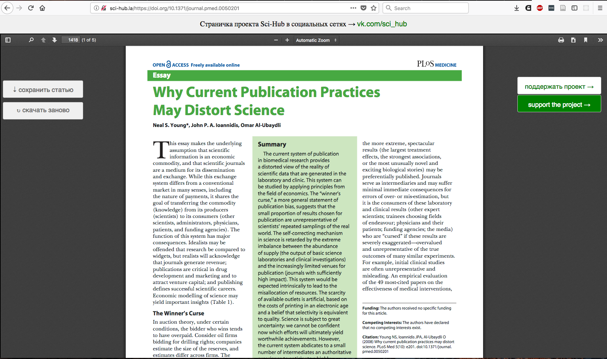

# How to Research Almost Anything Part 3: How to Access Almost any Scientific Paper with Unpaywall, Open Access Button, and Sci-hub

by [@timothystiles](https://twitter.com/TimothyStiles)

This is the third part of my tutorial series **How to Research Almost Anything**. This series will teach you:

1. [How to download tutorials and course material from youtube, edx, and coursera.](01-download-moocs.md)
2. [How to find almost any book with libgen and the gutenburg project.](02-find-almost-any-book.md)
3. [How to access almost any scientific article with sci-hub, unpaywall, and the openaccess button.](03-access-almost-any-scientific-paper.md)

## Introduction
In this article I'm going to list out some good open access journals, talk a little about preprints, and then show you how to access paywalled articles.

## Open Access Journals and Articles
Open access journals make all of their submitted articles freely avaialable to the public. 

### PLOS - Public Library of Science. 
[PLOS journals](https://www.plos.org/) typically focus on the biological sciences but they will accept papers on any topic that passes review in PLOS One.

### Elife
[Elife](https://elifesciences.org/) is another reputable open access life science journal.

### Open Library of Humanities
[OLH](https://www.openlibhums.org) is exactly what it says it is.

### Computer Science Conference Articles.
Most cutting edge computer science work is published in conference preceedings which tend to be more open and made freely available. For example [NIPS makes all of their papers freely available online](https://papers.nips.cc/paper/6606-wider-and-deeper-cheaper-and-faster-tensorized-lstms-for-sequence-learning).

## Preprints
Preprints are drafts of papers that get submitted to preprint servers for peers to review. They are almost always open access and on the cutting edge of research. They allow authors to establish precendence early, submit their papers to public review, and show off to potential publishers. Check out this [list of preprint servers by topic](https://researchpreprints.com/preprintlist/)! I'm personally a fan of [bioarxiv](https://www.biorxiv.org/).

## Getting Around Paywalls

Have you ever tried to read an academic paper and you get paywalled?

You could tried getting around it with the [open access](https://openaccessbutton.org/) or [unpaywall](https://unpaywall.org/) but if you're ever stumped or out of luck find your articles [DOI](https://en.wikipedia.org/wiki/Digital_object_identifier) and paste it into [sci-hub's search bar](http://sci-hub.tw/) like so:

Find the DOI on the page of the article you're trying to access.

Copy it into [sci-hub](http://sci-hub.tw/).

Retrieve your article and download it.

**You now have access to 64.5 million research articles!** If sci-hub ever goes down or isn't working check [wikipedia to see what sci-hub links are currently working](https://en.wikipedia.org/wiki/Sci-Hub).

## Zotero - An Open Source Citation Manager

Now that you've been through my series on how to access millions of books, articles, and courses for free you should find a way to manage and cite your sources! I use zotero a lot because of it's firefox citation plugin and the ability to drag premade citations into papers. You can get started with [zotero here!](https://www.zotero.org/support/quick_start_guide)

## Conclusion
This has been a part of my *How to Research Almost Anything* tutorial series. Check out the links below and be sure to follow me [@timothystiles](https://twitter.com/TimothyStiles) on twitter to get updates about my latest posts!

1. [How to download tutorials and course material from youtube, edx, and coursera.](01-download-moocs.md)
2. [How to find almost any book with libgen and the gutenburg project.](02-find-almost-any-book.md)
3. [How to access almost any scientific article with sci-hub, unpaywall, and the openaccess button.](03-access-almost-any-scientific-paper.md)

P.S If you've got anything to add please feel free to submit an issue or a pull request!

how-to-research-almost-anything © by Timothy Stiles

how-to-research-almost-anything is licensed under a Creative Commons Attribution-ShareAlike 4.0 International License.
You should have received a copy of the license along with this work. If not, see http://creativecommons.org/licenses/by-sa/4.0/.